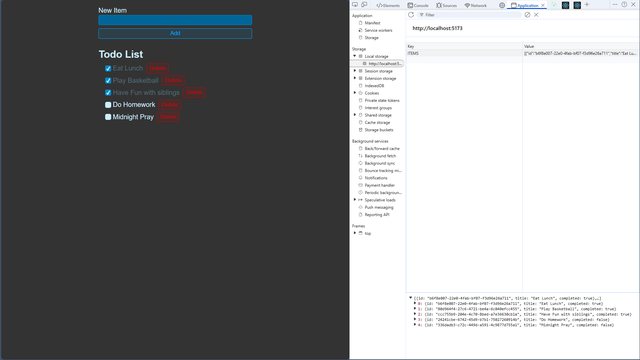

# Todo List React App

A small React todo app built with Vite. It lets you add tasks, mark them complete, delete them, and keeps your list saved in local storage so it stays available after a refresh.

## Preview

Add the screenshot you shared to `docs/todo-list-preview.png` and this preview section will render automatically.



## Features

- Add new todos from a simple form
- Mark todos as completed with a custom checkbox UI
- Delete tasks you no longer need
- Persist todos in browser local storage
- Lightweight React + Vite setup for fast development

## Tech Stack

- React 19
- Vite 8
- ESLint
- Browser localStorage for persistence

## Getting Started

### Prerequisites

- Node.js 18 or newer
- npm

### Install

```bash
npm install
```

### Start the development server

```bash
npm run dev
```

Open the local URL shown by Vite in your browser.

### Build for production

```bash
npm run build
```

### Preview the production build

```bash
npm run preview
```

## Project Structure

```text
src/
  App.jsx
  NewTodoForm.jsx
  TodoItem.jsx
  TodoList.jsx
  main.jsx
  styles.css
```

## Behavior

The app stores todos under the `ITEMS` key in local storage. Each todo includes an id, title, and completion state.

## License

This project includes the repository's existing [LICENSE](./LICENSE).
